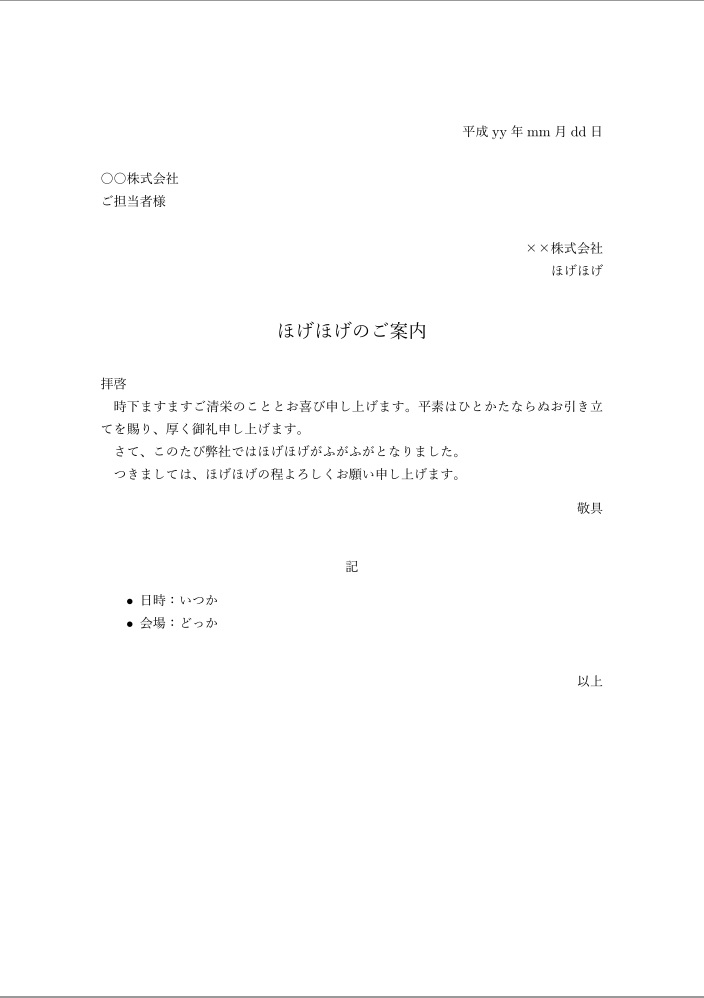

# jbusinessdoc

$\LaTeX$ style file for Japanese business documents.

$\LaTeX$でビジネス文書を書くためのスタイルファイル．

## 使用法

1. 普通の$\LaTeX$文章を用意する（$\mathrm{p}\LaTeX$もしくは$\mathrm{up}\LaTeX$で`jsarticle`を使用することを想定してるので，それ以外だと上手く動かないかも）
2. `jbusinessdoc.sty` をその$\LaTeX$文書のビルドが通る場所（例えば`.tex`ファイルと同じディレクトリ）に置く
3. プリアンブルに`\usepackage{jbusinessdoc}`と書く
4. `\title`，`\author`，`\date`のほかに，宛先を書くための`\destination`を書く
5. 必要があれば文章番号となる`\documentnumber`も書く（省略可）
6. ビルドする

## 機能

### 前付部分（`\maketitle`で出力）

- `\documentnumber`: 文章番号（省略可）
- `\date`: 日付
- `\destination`: 宛先（「ご担当者様」とか「各位」とか）
- `\author`: 作成者
- `\title`: タイトル

### 本文

### haikei 環境

`\begin{haikei}`～`\end{haikei}`で，別行立ての「拝啓（左ぞろえ）」～「敬具（右ぞろえ）」を出力してくれる．

### kigaki 環境

`\begin{kigaki}`～`\end{kigaki}`で，別行立ての「記（中央ぞろえ）」～「以上（右ぞろえ）」を出力してくれる．

## サンプル

```latex
\documentclass[uplatex,a4j,fleqn,12pt]{jsarticle}
\usepackage[top=35.01truemm,bottom=30truemm,left=30truemm,right=30truemm]{geometry}
\usepackage{jbusinessdoc}
%\documentnumber{文章番号第42号}
\date{平成yy年mm月dd日}
\destination{○○株式会社\\ご担当者様}
\author{××株式会社\\ほげほげ}
\title{ほげほげのご案内}
\begin{document}
\maketitle

\begin{haikei}
時下ますますご清栄のこととお喜び申し上げます。
平素はひとかたならぬお引き立てを賜り、厚く御礼申し上げます。

さて、このたび弊社ではほげほげがふがふがとなりました。

つきましては、ほげほげの程よろしくお願い申し上げます。
\end{haikei}

\begin{kigaki}
\begin{itemize}
    \item 日時：いつか
    \item 会場：どっか
\end{itemize}
\end{kigaki}
\end{document}
```

で



こんな感じに．
